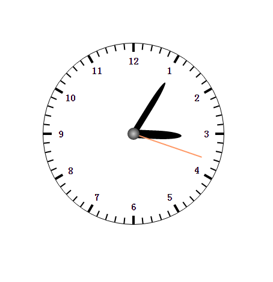

CSS3制作时钟
------------



### 代码

```javascript
<!DOCTYPE html>
<html>
    <head>
        <meta charset="utf-8">
        <title>css3时钟</title>
        <style media="screen">
            * {
                margin: 0;
                padding: 0;
            }
            .box {
                width: 300px;
                height: 300px;
                position: absolute;
                top: 100px;
                left: 100px;
                border: 1px solid #000;
                border-radius: 50%;
            }
            .box div {
                transform-origin: center bottom;
            }
            .cap {
                width: 20px;
                height: 20px;
                position: absolute;
                left: 50%;
                top: 50%;
                margin-left: -10px;
                margin-top: -10px;
                background: radial-gradient(#ccc,#000);
                border-radius: 50%;
            }
            .hour {
                width: 14px;
                height: 80px;
                background: #000;
                position: absolute;
                left: 50%;
                top: 50%;
                margin-left: -7px;
                margin-top: -80px;
                border-radius: 50% 50% 0 0;
            }
            .min {
                width: 10px;
                height: 100px;
                background: #000;
                position: absolute;
                left: 50%;
                top: 50%;
                margin-left: -5px;
                margin-top: -100px;
                border-radius: 50% 50% 0 0;
            }
            .sec {
                width: 2px;
                height: 120px;
                background: #f96;
                position: absolute;
                left: 50%;
                top: 50%;
                margin-left: -1px;
                margin-top: -120px;
            }
            .scale {
                width: 2px;
                height: 10px;
                background: #000;
                position: absolute;
                left: 50%;
                margin-left: -1px;
                transform-origin: center 150px;
            }
            .bs {
                width: 4px;
                height: 14px;
                background: #000;
                position: absolute;
                left: 50%;
                margin-left: -2px;
                transform-origin: center 150px;
            }
            .bs strong{
                width: 100px;
                text-align: center;
                position: absolute;
                left: 50%;
                margin-left: -50px;
                margin-top: 20px;
            }
        </style>
        <script type="text/javascript">
            window.onload = function(){
                var oBox = document.querySelector(".box");
                var oH = document.querySelector(".hour");
                var oM = document.querySelector(".min");
                var oS = document.querySelector(".sec");
                // 创建刻度
                for(var i = 0; i < 60; i++){
                    var oSpan = document.createElement("span");
                    oBox.appendChild(oSpan);
                    oSpan.style.transform = "rotate("+ i*6 +"deg)"
                    if(i % 5 == 0){
                        var number = i == 0?12:i/5;
                        oSpan.innerHTML="<strong>"+ number +"</strong>";
                        oSpan.children[0].style.transform = "rotate("+ -i*6 +"deg)"
                        oSpan.className="bs";
                    }else{
                        oSpan.className="scale";
                    }
                }

                tick();
                setInterval(tick, 30);
                function tick(){
                    var oDate = new Date();
                    var h = oDate.getHours();
                    var m = oDate.getMinutes();
                    var s = oDate.getSeconds();
                    var ms = oDate.getMilliseconds();

                    oH.style.transform = "rotate("+ (h+m/60)*30 +"deg)";
                    oM.style.transform = "rotate("+ (m+s/60)*6 +"deg)";
                    oS.style.transform = "rotate("+ (s+ms/1000)*6 +"deg)";
                }
            }
        </script>
    </head>
    <body>
        <div class="box">
            <div class="hour"></div>
            <div class="min"></div>
            <div class="sec"></div>
            <div class="cap"></div>
        </div>
    </body>
</html>

```
